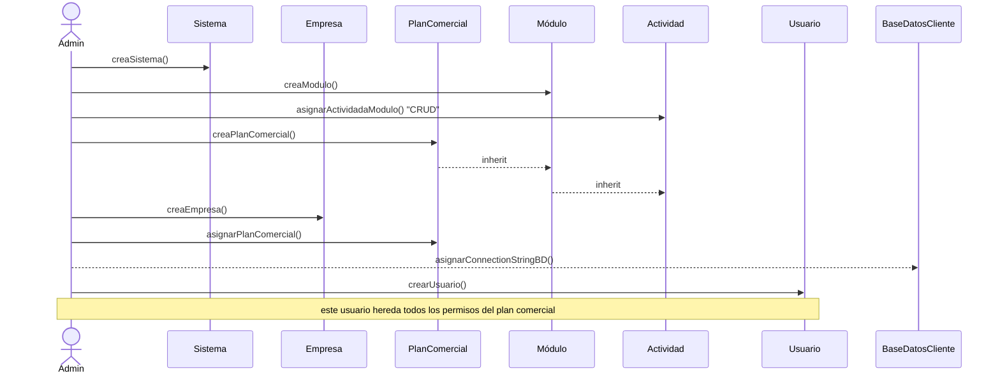

# Módulo de Seguridad

El siguiente documento presenta una vista general del módulo de seguridad.

```mermaid
sequenceDiagram
    actor Admin
    participant Sistema
    participant Empresa
    participant PlanComercial
    participant Módulo
    participant Actividad
    participant Usuario
    participant BaseDatosCliente

    Admin->>Sistema: creaSistema()
    Admin->>Módulo: creaModulo()
    Admin->>Actividad: asignarActividadaModulo() "CRUD"
    Admin->>PlanComercial: creaPlanComercial()
    PlanComercial-->>Módulo: inherit
    Módulo-->>Actividad: inherit
    Admin->>Empresa: creaEmpresa()
    Admin->>PlanComercial: asignarPlanComercial()
    Admin-->>BaseDatosCliente: asignarConnectionStringBD()
    Admin->>Usuario: crearUsuario()
    Note over Admin, Usuario: este usuario hereda todos los permisos del plan comercial

```
