# Diagrama de dependencias KrezkaMas

Este documento presenta un diagrama de las dependencias de diferentes proyectos e infraestructura de Krezka.

## Login

El siguiente diagrama describe el proceso de Login

```mermaid
sequenceDiagram
    participant FrontEnd
    participant BackEnd
    participant DBKrezca
    participant APISeguridad
    participant BDSeguridad
    participant Redis
    participant CFDIGlobal(Masteredi)
    participant Queue(SA)
    participant AzureFunction
    participant TableStorage(SA)
    participant BlobStorage(SA)
    participant CP(Masteredi)

    FrontEnd->>Backend: login(usuario,contraseña)
    Backend->>APISeguridad: validaUsuario()
    APISeguridad->>DBSeguridad: getData()
    DBSeguridad->>APISeguridad: Data
    APISeguridad->>Backend: success()
    Backend->>Redis: returnDetail()
```

## Generar Cliente

El siguiente diagrama describe el proceso de crear un cliente

## Generar Factura

El siguiente diagrama describe el proceso de creación de una factura.

