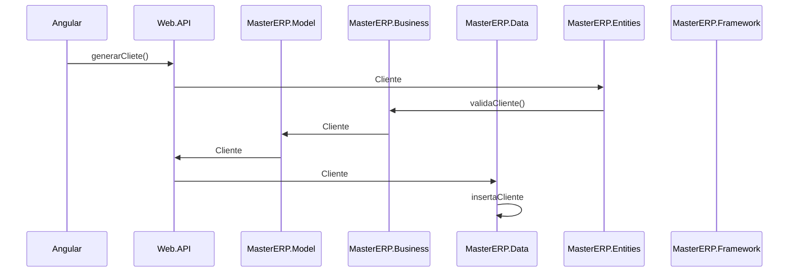
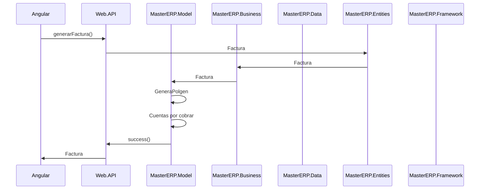

# Diagrama de componentes
Este documento contiene el diagrama de componentes referentes al proyecto KrezkaMas

El siguiente diagrama es un ejemplo de conexión entre componentes para generar un cliente.

El siguiente diagrama es un ejemplo de conexión entre componentes para generar una factura

## Descripción de componentes

### Angular
Este proyecto es la cara al usuario.
Proyecto Angular 12 con implementación de md-bootstrap.

### Web.API
Este proyecto es el backend para ser consumido por el front y es el punto de entrada para las demás capas.
.NetFramework 4.6

### MasterERP.Model
Este proyecto es un paso entre capas, y lógica de negocio como facturación, recepción, cuentas por cobrar y en algún futuro, manejo de inventario.

### MasterERP.Business
Este proyecto es un paso entre capas.

### MasterERP.Data
Este proyecto tiene toda la lógica de acceso a datos y algunas reglas de negocio.

### MasterERP.Entities
Este proyecto tiene la representación de todos los objetos presentados a clases de la base de datos y algunos DTO.

### MasterERP.Framework
Este proyecto contiene librerías interiores y utilidades como: compresión de zip, decimales, cálculos de fechas con base en usos horarios, lógica de descarga de archivos.
