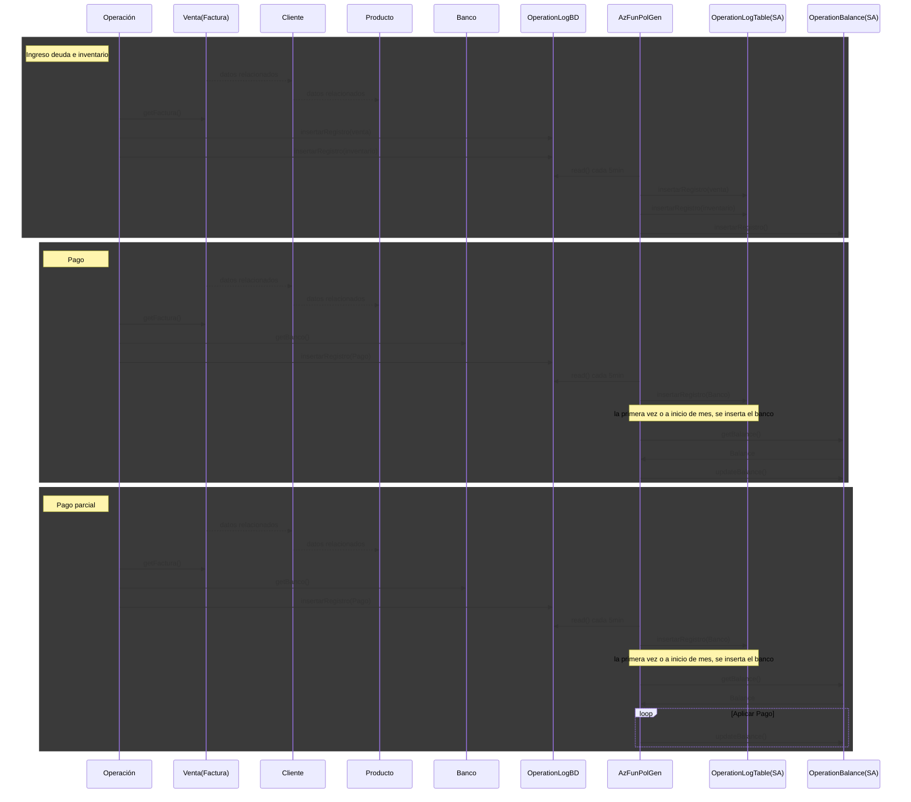

# Póliza General

El siguiente documento describe el proceso de póliza general en el sistema Krezka con un ejemplo específico de una venta con factura.

```mermaid
sequenceDiagram
    participant Operación
    participant Venta(Factura)
    participant Cliente
    participant Producto
    participant Banco
    participant OperationLogBD
    participant AzFunPolGen
    participant OperationLogTable(SA)
    participant OperationBalance(SA)

    rect rgb(58, 58, 58)
    note left of Operación: Ingreso deuda e inventario
    Venta(Factura)-->>Cliente: datos relacionados
    Cliente-->>Producto: datos relacionados
    Operación->>Venta(Factura): getFactura()
    Operación->>OperationLogBD: insertarRegistro(venta)
    Operación->>OperationLogBD: insertarRegistro(inventario)
    AzFunPolGen->>OperationLogBD: read() cada 5min
    AzFunPolGen->>OperationLogTable(SA): insertarRegistro(venta)
    AzFunPolGen->>OperationLogTable(SA): insertarRegistro(inventario)
    AzFunPolGen->>OperationBalance(SA): insertarRegistro()
    end

    rect rgb(58, 58, 58)
    note left of Operación: Pago
    Venta(Factura)-->>Cliente: datos relacionados
    Cliente-->>Producto: datos relacionados
    Operación->>Venta(Factura): getFactura()
    Operación->>Banco: getBanco()
    Operación->>OperationLogBD: insertarRegistro(Pago)
    AzFunPolGen->>OperationLogBD: read() cada 5min
    AzFunPolGen->>OperationLogTable(SA): insertarRegistro(Banco)
    Note over AzFunPolGen, OperationLogTable(SA): la primera vez o a inicio de mes, se inserta el banco
    AzFunPolGen->>OperationBalance(SA): getBalance()
    OperationBalance(SA)->>AzFunPolGen: Balance
    AzFunPolGen->>OperationBalance(SA): updateBalance()
    end

    rect rgb(58, 58, 58)
    note left of Operación: Pago parcial
    Venta(Factura)-->>Cliente: datos relacionados
    Cliente-->>Producto: datos relacionados
    Operación->>Venta(Factura): getFactura()
    Operación->>Banco: getBanco()
    Operación->>OperationLogBD: insertarRegistro(Pago)
    AzFunPolGen->>OperationLogBD: read() cada 5min
    AzFunPolGen->>OperationLogTable(SA): insertarRegistro(Banco)
    Note over AzFunPolGen, OperationLogTable(SA): la primera vez o a inicio de mes, se inserta el banco
    AzFunPolGen->>OperationBalance(SA): getBalance()
    OperationBalance(SA)->>AzFunPolGen: Balance
    loop Aplicar Pago
    AzFunPolGen->>OperationBalance(SA): updateBalance()
    end
    end
```
